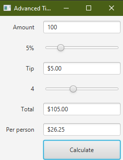
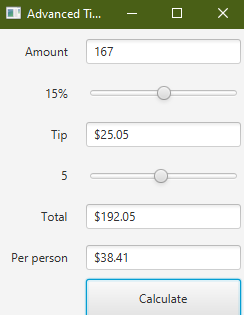

This is an advanced tip calculator where you can enter the amount and then select how much tip you want to give in percentage by using a slider.
Then you have to select the number of people who are paying the bill. This calculator will calculate the total amount payable and will divide it
equally among the people who are paying the bill.
PS: Add javafx-sdk to the libray of the project and set the VM accoding to your operating system.
You can download the javafx libray from https://gluonhq.com/products/javafx/.
You can see how to setup intellij according to your operating system from https://openjfx.io/openjfx-docs/

ScreenShots:

